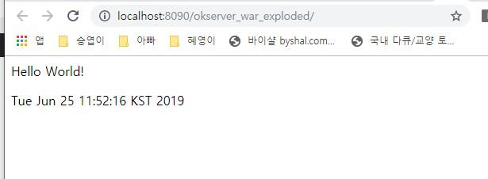
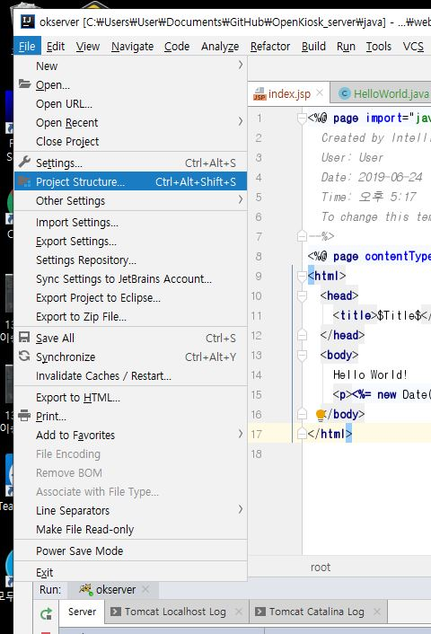
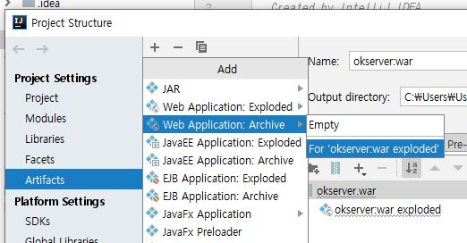
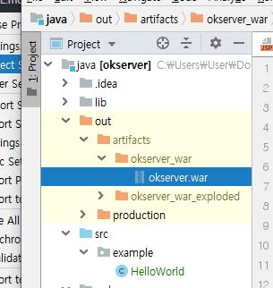

# OpenKiosk_server
- 본 프로젝트의 핵심이 되는 기능을 우선적으로 구현
+ 핵심 기능
  - Amazon API를 활용한 리뷰 분석
  - 리뷰에 대한 통계 도출(긍정,부정 평가)
  - 매출 통계
---
## 자바 환경변수
- JAVA_HOME 추가 = 설치 경로
- ex\) C:\Program Files\Java\jdk1.8.0_131
- Path 수정 = %JAVA_HOME%\bin
- CLASSPATH 추가 = %JAVA_HOME%\lib
---
## TomCat 설치 후 프로젝트 생성
- 톰캣 설치시 **jre** 필요
- 설치 후 Intellij에서 web 프로젝트 생성

- 프로젝트 설정시 Tomcat 설치 위치 지정
- 프로젝트 이름을 설정하고 Finish  
---
## 2019-06-24
- 프로젝트 생성 및 Hello world 출력

## 2019-06-25
- 처음 실행하면 못보던 폴더인 **out 폴더가** 생성
- 이는 run하는 과정에서 war 파일이 풀어지면서 배포 가능한 형태로 생성되는 것
- 이는 Project Structure 에서 몇가지 옵션을 건들면 잡다하게 파일을 생성하는게 아닌 **zip 파일 하나로** 만들수도 있음  

### 웹서비스 동작 원리
 웹서비스는 **[클라이언트-서버](https://ko.wikipedia.org/wiki/%ED%81%B4%EB%9D%BC%EC%9D%B4%EC%96%B8%ED%8A%B8_%EC%84%9C%EB%B2%84_%EB%AA%A8%EB%8D%B8)** 구조로 구성되어있습니다. 서버는 서비스를 제공하는 컴퓨터이고, 클라이언트는 서비스를 이용하는 사용자입니다. 이러한 동작은 요청과 응답이라는 매커니즘을 통해 동작합니다.
  
[ 그림 출처 : https://cloudstudying.kr/lectures/58#web-service](https://cloudstudying.kr/lectures/58#web-service)
간단히 설명하면 어떠한 버튼을 눌러 링크를 불러오게 되는 행위(예를 들어 웹툰)은 **『요청』** 이 되는것이고 누르는 행위에 대해 새로운 페이지가 열리는(웹툰링크를 타고 페이지가 열리는) 동작이 수행되면 이는 **『응답』** 행위가 수행된것입니다.

### JSP(Java Server Pages)
jsp는 HTML과 자바 코드를 같이 사용할 수 있게 해주는 스크립트 언어입니다. 사용 형태는 HTML 코드 사이에 **<% %>** 구문이 적혀있고 그 사이에 원하는 동작(**Java코드**)을/를 지정하면 알아서 서버측에서 재해석 및 변환하여 웹페이지에 적용시킵니다.

[그림 출처 : https://i.imgur.com/kV314tG.png](https://i.imgur.com/kV314tG.png)
+ JSP 태그 <% %>
  - <%@  지시지, 페이지 속성 지정 @%>
  - <%-  주  석, 페이지 설명 작성 -%>
  - <%!  선  언, 변수/메쏘드 선언 !%>
  - <%=  표현식, 결과를 문자열로 출력 =%>
  - \<jsp:action> [자바빈](https://ko.wikipedia.org/wiki/%EC%9E%90%EB%B0%94%EB%B9%88%EC%A6%88) 또는 [애플릿 모듈](https://ko.wikipedia.org/wiki/%EC%9E%90%EB%B0%94_%EC%95%A0%ED%94%8C%EB%A6%BF)과 연동 </jsp:action>
