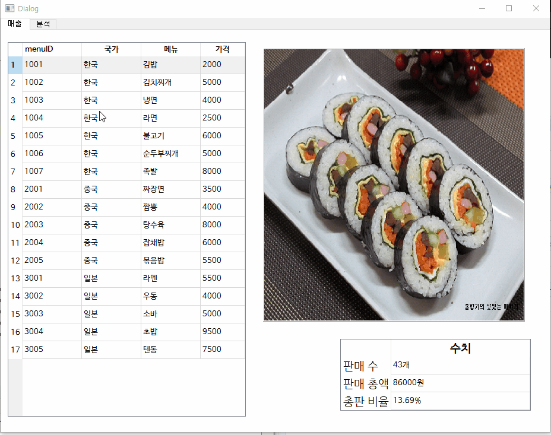
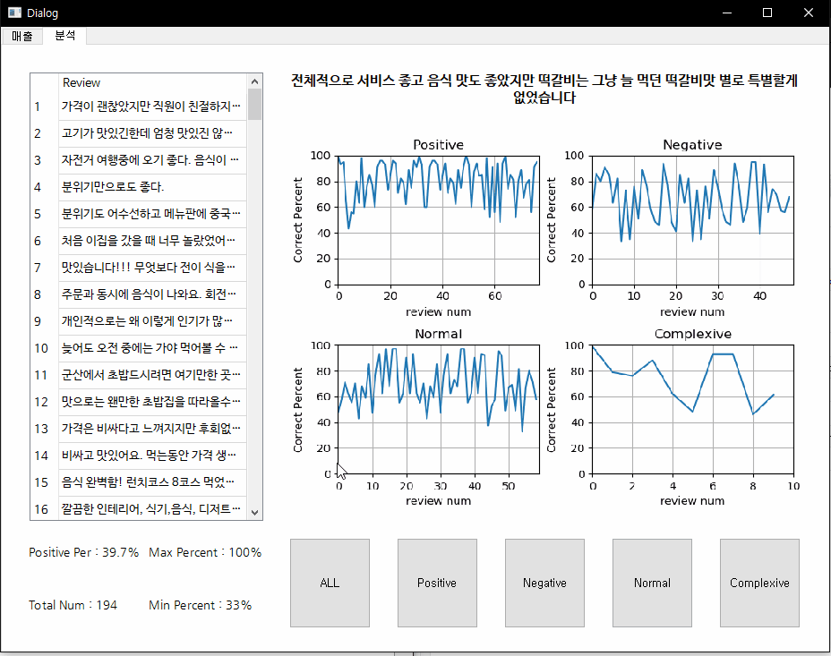

# OpenKiosk_server
- 본 프로젝트의 핵심이 되는 기능을 우선적으로 구현
+ 핵심 기능
  - Amazon API를 활용한 리뷰 분석
  - 리뷰에 대한 통계 도출(긍정,부정 평가)
+ 사용  외부모듈(라이브러리)
  - PyQt5:  GUI 툴
  - Amazon API: 한글->영문 번역(Amazon Translate) 및 문장 분석(Amazon Comprehend)
  - Beautiful soup4: 웹 크롤링
  - pyMySQL: MySQL DataBase 연동
  
### 프로젝트 파일
+ exApi
    - 외부 API를 활용한 모듈 디렉토리  
    - Amazon Comperhend, Amazon Translate, BeautifulSoup4 사용
+ qtDesinger
    - Pyqt5를 이용한 gui 테스트 및 파일 저장 디렉토리

+ Sync.py
    - DB와 연결되는 객체(pymysql 모듈)
    - DB의 데이터를 정보로 만들어 List 형태로 저장
    - 정보를 도식화한 그래프를 만들어주기도 함(matplot 모듈)
    
+ GUI.py
    - 프로젝트의 MAIN이 되는 소스 파일
    - GUI 버튼의 이벤트 처리 구현
    - 위의 객체 및 직접 정의한 모듈을 이용하여 다양한 기능을 수행함.
    
### 프로젝트 GUI(음식점의 예)
+ Page 1 : 매출
    1. 왼쪽 테이블은 전체 메뉴를 나타냅니다.
    2. 테이블에서 원하는 행(row)를 클릭하시면 메뉴 사진과 함께 팔린 갯수, 총 판매액, 판매 비율을 알수있습니다.
     
- Page 2 : 분석
    1. 아래 버튼은 리뷰의 성향을 총 4개(긍정, 부정, 중립, 복합)로 나누어 보여주게 구성하였습니다.
    2. 해당 버튼을 누르면 해당 성향에 맞는 리뷰가 왼쪽 테이블에 표시되며, 개략적인 그래프를 보여줍니다.
    3. 해당 메뉴의 행(row)를 클릭하시면 전체 리뷰를 볼 수 있습니다.
    

### 기대효과
1. 일일히 하나씩 읽어가며 리뷰가 되었든 과제가 되었든 특정 형태의 문서를 빠르고 쉽게 종합분석이 가능합니다.
2. 특히 판매직 분야에서 소비자의 리뷰를 분석함에 특화되어 있어 소비자 성향을 알기 쉬워집니다.
3. (2)의 정보를 공개함으로 소비자도 합리적인 소비를 유도할 수 있습니다.
    
### 미구현 과제
1. 통계의 신뢰도가 미흡하여 통계 전문가를 통한 통계 도출 알고리즘의 수정이 필요합니다.
2. Amazon Comperhend는 한글이 공식적으로 지원이 되지않아 한글 분석 전문가의 영입이 필요합니다.

